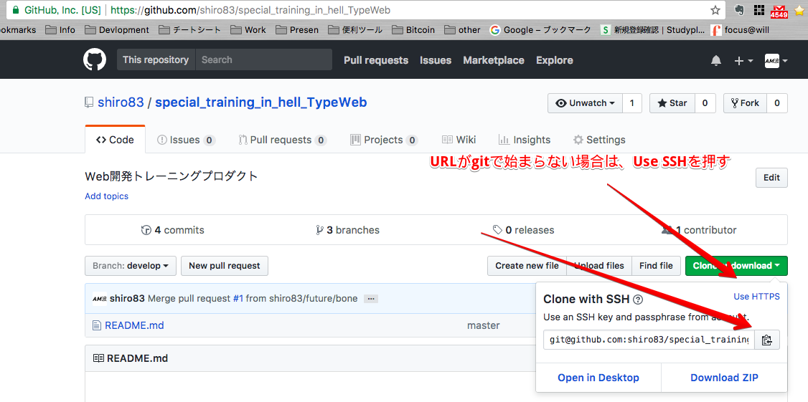
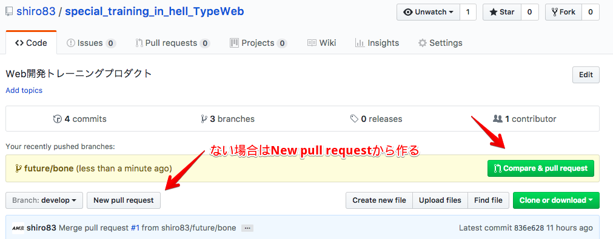
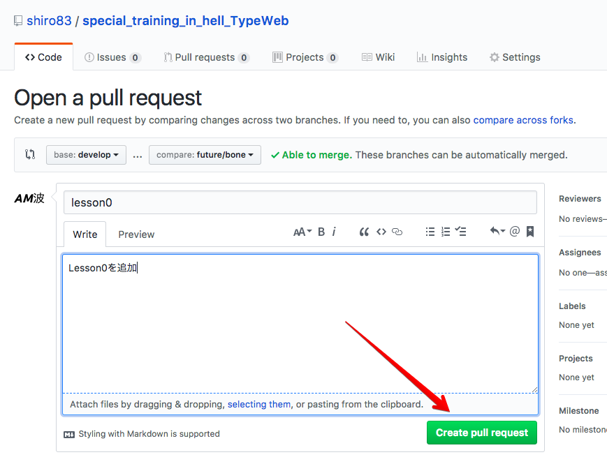
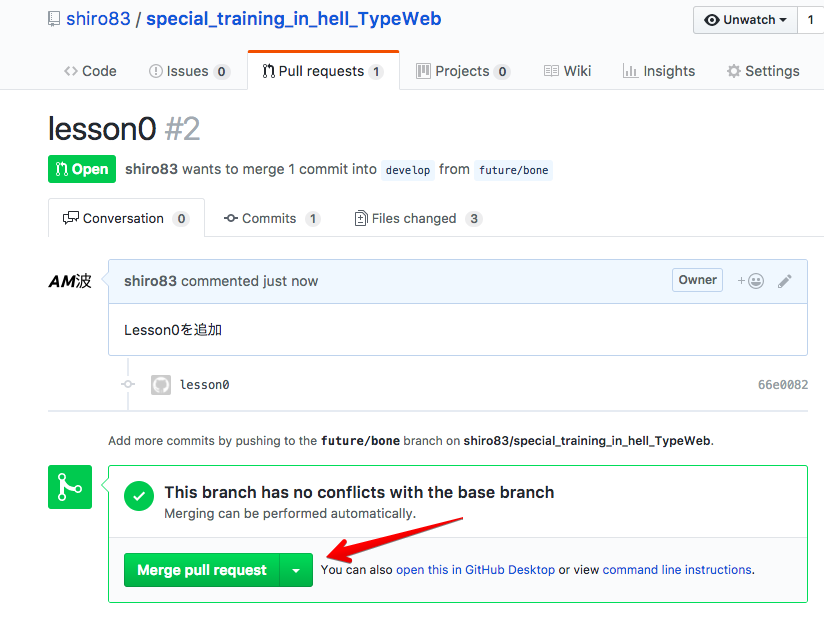

# Lesson0 Gitを使ってGitHubにpushしよう！

Lessonでは成果物をGitHubにpushして貰います。  
さっそくGitを使ってGitHubへpushしてみましょう！  

## Gitって？
プログラムソースなどの変更履歴を管理する分散型のバージョン管理システムのことです。（コマンドラインのアプリケーションと言って差し支えない）

## GitHubって？gitと違うものなの？
GitHubとは、Gitの仕組みを利用して、世界中の人々が自分プログラムコードなどを保存、公開することができるようにしたWebサービスです。

## Gitのコマンドって難しそうで何やってるかわからない。。。。
口からクソを垂れる前にこのサイトを読んでみましょう！
[【Git入門者向け】イメージで理解するGitコマンド事始め](http://kinokoru.jp/archives/1017)


## git-flow
多人数で開発する場合の効果的なバージョン管理手法のこと。 (またはそれを行うgit-flowというツール)   
本来、小規模のプロジェクトはこんなに大げさにする必要はありませんが、今回はお勉強なのでことパターンで実施しましょう！

git-flowは6種類のブランチを役割ごとに使い分けるのですが、実際は３種類知っていれば何とかなります。

#### masterブランチ
リリースした最終ブランチdevelopブランチからマージする以外で更新してはいけない。

#### developブランチ
開発の中心となるブランチ、開発中は最新のdevelopブランチから更新情報を取得し、作業完了後にdevelopブランチにマージするという作業を繰り返す。masterブランチ同様、直接このブランチにコミットすることはないので注意する。

#### featureブランチ
開発中で最も使われるブランチ、ひとつの変更に対してひとつの feature ブランチを切るのが理想である。fetureブランチを切る->開発->developにマージ->futureブランチ削除といった具合に進める。  
ブランチの名前は、変更の内容がすぐに分かるような名称にする。たとえばfuture/backdoorなど。

詳しくはこうゆうページを参照  
[バージョン管理システム入門(初心者向け)by tracpath](http://tracpath.com/bootcamp/learning_git_git_flow.html)

## 実践
さて、能書きはこれくらいにして実際にやってみましょう！

### ターミナル起動
Macの人はterminal、Windowsの人はプログラムからGit Bashを起動します。

### リポジトリからclone
+ GitHubを開く[https://github.com/shiro83/special_training_in_hell_TypeWeb](https://github.com/shiro83/special_training_in_hell_TypeWeb)
+ 緑色の「clone or download」を押下し、URLをコピーする


+ 次のコマンドを実行し、cloneする（適当な場所でOKここではuserディレクトリ下にNwLessonというディレクトリを作り、そこでcloneする）
```
$ mkdir ~/NwLesson
$ cp ~/NwLesson
$ git clone git@github.com:shiro83/special_training_in_hell_TypeWeb.git
```


### cloneしたディレクトリに移動してfutureブランチを切る
+ プロジェクトディレクトリに移動
```
$ cd special_training_in_hell_TypeWeb
```


+ developブランチに切り替えて最新化する。
```
$ git checkout develop
$ git branch
$ git pull origin develop
```
      + `git checkout`はブランチの切り替え
  + `git branch`で今いるブランチの確認
  + `git pull`で`develop`ブランチから最新を取得する
  + ちなみに`origin`はURLの省略文字(本当はgit@〜)、`develop`は取得ブランチ名を指す


  + futureブランチを切る、ここでのブランチ名はfuture/lesson0としてみる
  ```
  $ git checkout -b future/lesson0
  $ git branch
  ```
     + git checkoutに-bオプションをつけると、移動とセットでブランチの作成も出来る

### atomを使ってファイルを編集する
+ atomを起動する
+ ファイル->プロジェクトフォルダの追加からspecial_training_in_hell_TypeWebを追加する
+ special_training_in_hell_TypeWeb/Lesson0/what_time_is_it_now.txtに現在日付を***追加***する
+ 保存を忘れずに!

### GitHubに`push`！
+ まずはローカルにコミットする
```
$ git add .
$ git commit -m '日時を追加'
$ git status
$ git diff HEAD^
```
  + `git add .`でステージングに変更があったファイルを全て追加(`.`をファイル名にすればそいつだけになる)
  + `git commit -m`でステージングの変更をコミット
  + `git status`でgitの状態を確認
  + `git diff HEAD^`でcommitする変更点を確認、`q`で終了する


+ いよいよGitHubにpush!
```
$ git push origin future/lesson0
```


### GitHub上で`pull request`
GitHub上でdevelopブランチにマージする依頼をする。
+ GitHubを開く[https://github.com/shiro83/special_training_in_hell_TypeWeb](https://github.com/shiro83/special_training_in_hell_TypeWeb)
+ 「Compare & pull request」を押下する


+ 適当に入力して、「Create pull request」を押下


+ 誰かのレビューが完了したら、「Merge pullrequest」を押下


+ delete branchしちゃってOK

## もう少し詳細までやりたい場合はこちら  
[LearnGitBranching](http://k.swd.cc/learnGitBranching-ja/)


# ！もしかしたら、ローカルブランチでdevelopブランチにマージしてdevelopブランチをpushするのが正しいかも？（だれか教えて）
